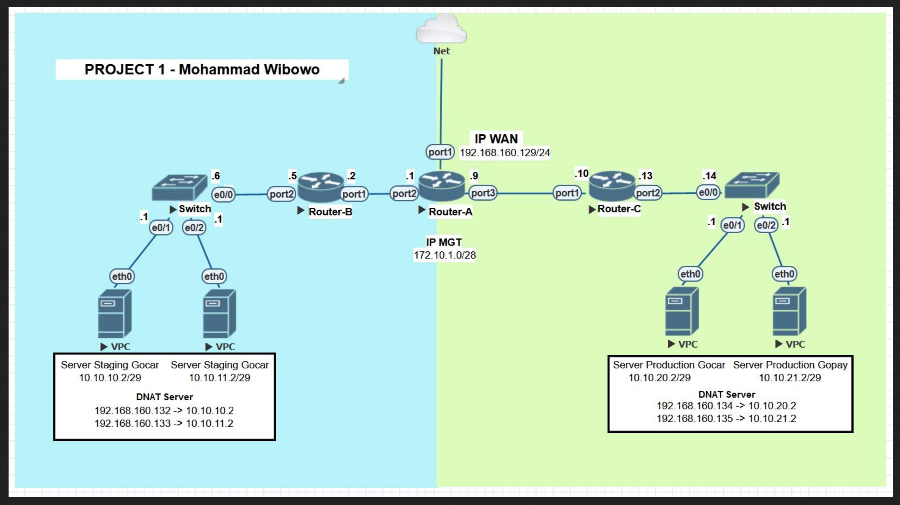

# MiniProject-Network Fundamental

In this case, provide the configuration IP Address for each application server and node network, so that all the server can be access from Internet.

## Topologi Network Infrastructure

## Deployment

The first step, you can create a testing lab and drawing the topology network Infrastructure using Eve-ng. Eve-ng the emulated virtual environtment for network, security, etc.
## Authors

- [@mwbowo](https://www.github.com/mwbowo)

